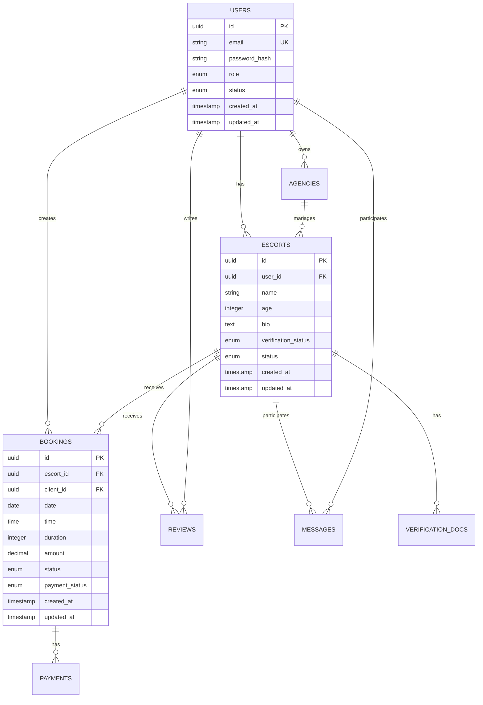

# Technical Architecture - Premium Escorts Directory

## System Architecture Overview

### High-Level Architecture

```
┌─────────────────┐    ┌─────────────────┐    ┌─────────────────┐
│   Frontend      │    │   Backend API   │    │   Database      │
│   (Next.js)     │◄──►│   (Node.js)     │◄──►│   (PostgreSQL)  │
└─────────────────┘    └─────────────────┘    └─────────────────┘
         │                       │                       │
         │                       │                       │
         ▼                       ▼                       ▼
┌─────────────────┐    ┌─────────────────┐    ┌─────────────────┐
│   CDN           │    │   Redis Cache   │    │   File Storage  │
│   (Cloudflare)  │    │   (Session)     │    │   (Cloudinary)  │
└─────────────────┘    └─────────────────┘    └─────────────────┘
```

### Technology Stack

#### Frontend
- **Framework**: Next.js 14 (App Router)
- **Language**: TypeScript
- **Styling**: Tailwind CSS
- **UI Components**: Radix UI
- **State Management**: React Context + Zustand
- **Forms**: React Hook Form + Zod
- **Authentication**: NextAuth.js
- **Real-time**: Socket.io Client

#### Backend
- **Runtime**: Node.js 18+
- **Framework**: Express.js
- **Language**: TypeScript
- **Database**: PostgreSQL 15+
- **ORM**: Prisma
- **Caching**: Redis
- **Authentication**: JWT + NextAuth.js
- **Real-time**: Socket.io
- **File Upload**: Multer + Cloudinary

#### Infrastructure
- **Hosting**: Vercel (Frontend) + Railway/AWS (Backend)
- **Database**: PlanetScale/AWS RDS
- **CDN**: Cloudflare
- **Monitoring**: Sentry + Vercel Analytics
- **Email**: Resend/SendGrid
- **Payments**: Stripe

## Database Design

### Core Entity Relationship Diagram



### Database Schema Details

#### Users Table
```sql
CREATE TYPE user_role AS ENUM ('client', 'escort', 'agency', 'admin');
CREATE TYPE user_status AS ENUM ('pending', 'active', 'suspended', 'banned');

CREATE TABLE users (
    id UUID PRIMARY KEY DEFAULT gen_random_uuid(),
    email VARCHAR(255) UNIQUE NOT NULL,
    password_hash VARCHAR(255) NOT NULL,
    role user_role NOT NULL,
    status user_status DEFAULT 'pending',
    email_verified BOOLEAN DEFAULT FALSE,
    phone VARCHAR(20),
    first_name VARCHAR(100),
    last_name VARCHAR(100),
    avatar_url VARCHAR(500),
    date_of_birth DATE,
    created_at TIMESTAMP DEFAULT NOW(),
    updated_at TIMESTAMP DEFAULT NOW()
);

CREATE INDEX idx_users_email ON users(email);
CREATE INDEX idx_users_role ON users(role);
CREATE INDEX idx_users_status ON users(status);
```

#### Escorts Table
```sql
CREATE TYPE verification_status AS ENUM ('pending', 'verified', 'rejected');
CREATE TYPE escort_status AS ENUM ('active', 'inactive', 'suspended');

CREATE TABLE escorts (
    id UUID PRIMARY KEY DEFAULT gen_random_uuid(),
    user_id UUID REFERENCES users(id) ON DELETE CASCADE,
    name VARCHAR(255) NOT NULL,
    age INTEGER NOT NULL CHECK (age >= 18),
    height INTEGER, -- in cm
    weight INTEGER, -- in kg
    measurements VARCHAR(50),
    hair_color VARCHAR(50),
    eye_color VARCHAR(50),
    ethnicity VARCHAR(100),
    languages TEXT[], -- array of languages
    bio TEXT,
    services JSONB, -- array of service objects
    rates JSONB, -- array of rate objects
    locations JSONB, -- array of location objects
    availability JSONB, -- array of availability objects
    verification_status verification_status DEFAULT 'pending',
    status escort_status DEFAULT 'active',
    featured BOOLEAN DEFAULT FALSE,
    rating DECIMAL(3,2) DEFAULT 0,
    review_count INTEGER DEFAULT 0,
    view_count INTEGER DEFAULT 0,
    created_at TIMESTAMP DEFAULT NOW(),
    updated_at TIMESTAMP DEFAULT NOW()
);

CREATE INDEX idx_escorts_user_id ON escorts(user_id);
CREATE INDEX idx_escorts_status ON escorts(status);
CREATE INDEX idx_escorts_verification ON escorts(verification_status);
CREATE INDEX idx_escorts_featured ON escorts(featured);
CREATE INDEX idx_escorts_rating ON escorts(rating);
```

#### Bookings Table
```sql
CREATE TYPE booking_status AS ENUM ('pending', 'confirmed', 'completed', 'cancelled', 'no-show', 'rescheduled');
CREATE TYPE payment_status AS ENUM ('pending', 'paid', 'refunded', 'partial');

CREATE TABLE bookings (
    id UUID PRIMARY KEY DEFAULT gen_random_uuid(),
    escort_id UUID REFERENCES escorts(id) ON DELETE CASCADE,
    client_id UUID REFERENCES users(id) ON DELETE CASCADE,
    agency_id UUID REFERENCES agencies(id) ON DELETE SET NULL,
    date DATE NOT NULL,
    time TIME NOT NULL,
    duration INTEGER NOT NULL, -- in minutes
    services TEXT[] NOT NULL,
    location VARCHAR(500) NOT NULL,
    amount DECIMAL(10,2) NOT NULL,
    status booking_status DEFAULT 'pending',
    payment_status payment_status DEFAULT 'pending',
    notes TEXT,
    special_requests TEXT,
    cancellation_reason TEXT,
    cancellation_fee DECIMAL(10,2),
    refund_amount DECIMAL(10,2),
    rating INTEGER CHECK (rating >= 1 AND rating <= 5),
    review TEXT,
    review_date TIMESTAMP,
    is_urgent BOOLEAN DEFAULT FALSE,
    is_overnight BOOLEAN DEFAULT FALSE,
    is_outcall BOOLEAN DEFAULT FALSE,
    is_incall BOOLEAN DEFAULT FALSE,
    metadata JSONB, -- additional booking data
    created_at TIMESTAMP DEFAULT NOW(),
    updated_at TIMESTAMP DEFAULT NOW()
);

CREATE INDEX idx_bookings_escort_id ON bookings(escort_id);
CREATE INDEX idx_bookings_client_id ON bookings(client_id);
CREATE INDEX idx_bookings_date ON bookings(date);
CREATE INDEX idx_bookings_status ON bookings(status);
CREATE INDEX idx_bookings_payment_status ON bookings(payment_status);
```

## API Architecture

### RESTful API Design

#### Authentication Endpoints
```typescript
// POST /api/auth/register
interface RegisterRequest {
  email: string;
  password: string;
  role: 'client' | 'escort' | 'agency';
  firstName: string;
  lastName: string;
  phone?: string;
}

// POST /api/auth/login
interface LoginRequest {
  email: string;
  password: string;
}

// POST /api/auth/refresh
interface RefreshRequest {
  refreshToken: string;
}
```

#### Escort Endpoints
```typescript
// GET /api/escorts
interface EscortSearchParams {
  location?: string;
  services?: string[];
  priceMin?: number;
  priceMax?: number;
  ageMin?: number;
  ageMax?: number;
  ethnicity?: string[];
  languages?: string[];
  availability?: string;
  ratingMin?: number;
  verifiedOnly?: boolean;
  featuredOnly?: boolean;
  page?: number;
  limit?: number;
  sortBy?: 'rating' | 'price' | 'name' | 'created_at';
  sortOrder?: 'asc' | 'desc';
}

// POST /api/escorts
interface CreateEscortRequest {
  name: string;
  age: number;
  bio: string;
  services: Service[];
  rates: Rate[];
  locations: Location[];
  availability: Availability[];
}
```

#### Booking Endpoints
```typescript
// POST /api/bookings
interface CreateBookingRequest {
  escortId: string;
  date: string;
  time: string;
  duration: number;
  services: string[];
  location: string;
  amount: number;
  notes?: string;
  specialRequests?: string;
  isUrgent?: boolean;
  isOvernight?: boolean;
  isOutcall?: boolean;
  isIncall?: boolean;
}

// PUT /api/bookings/:id/status
interface UpdateBookingStatusRequest {
  status: 'confirmed' | 'completed' | 'cancelled' | 'no-show' | 'rescheduled';
  reason?: string;
}
```

### GraphQL Schema (Alternative)

```graphql
type User {
  id: ID!
  email: String!
  role: UserRole!
  status: UserStatus!
  firstName: String
  lastName: String
  avatarUrl: String
  createdAt: DateTime!
  updatedAt: DateTime!
}

type Escort {
  id: ID!
  user: User!
  name: String!
  age: Int!
  bio: String
  services: [Service!]!
  rates: [Rate!]!
  locations: [Location!]!
  availability: [Availability!]!
  verificationStatus: VerificationStatus!
  status: EscortStatus!
  featured: Boolean!
  rating: Float!
  reviewCount: Int!
  viewCount: Int!
  createdAt: DateTime!
  updatedAt: DateTime!
}

type Booking {
  id: ID!
  escort: Escort!
  client: User!
  date: Date!
  time: Time!
  duration: Int!
  services: [String!]!
  location: String!
  amount: Float!
  status: BookingStatus!
  paymentStatus: PaymentStatus!
  createdAt: DateTime!
  updatedAt: DateTime!
}

type Query {
  escorts(
    location: String
    services: [String!]
    priceMin: Float
    priceMax: Float
    ageMin: Int
    ageMax: Int
    ratingMin: Float
    verifiedOnly: Boolean
    featuredOnly: Boolean
    page: Int
    limit: Int
    sortBy: EscortSortBy
    sortOrder: SortOrder
  ): EscortConnection!
  
  escort(id: ID!): Escort
  bookings(userId: ID!): [Booking!]!
  booking(id: ID!): Booking
}

type Mutation {
  createBooking(input: CreateBookingInput!): Booking!
  updateBookingStatus(id: ID!, status: BookingStatus!): Booking!
  createReview(input: CreateReviewInput!): Review!
}
```

## Security Architecture

### Authentication & Authorization

#### JWT Token Structure
```typescript
interface JWTPayload {
  sub: string; // user ID
  email: string;
  role: UserRole;
  permissions: string[];
  iat: number; // issued at
  exp: number; // expiration
  jti: string; // JWT ID for revocation
}
```

#### Role-Based Access Control (RBAC)
```typescript
enum Permission {
  // User permissions
  READ_OWN_PROFILE = 'read:own_profile',
  UPDATE_OWN_PROFILE = 'update:own_profile',
  
  // Escort permissions
  READ_ESCORT_PROFILES = 'read:escort_profiles',
  CREATE_ESCORT_PROFILE = 'create:escort_profile',
  UPDATE_OWN_ESCORT_PROFILE = 'update:own_escort_profile',
  
  // Booking permissions
  CREATE_BOOKING = 'create:booking',
  READ_OWN_BOOKINGS = 'read:own_bookings',
  UPDATE_OWN_BOOKINGS = 'update:own_bookings',
  
  // Admin permissions
  READ_ALL_USERS = 'read:all_users',
  UPDATE_USER_STATUS = 'update:user_status',
  READ_ALL_BOOKINGS = 'read:all_bookings',
  UPDATE_ANY_BOOKING = 'update:any_booking',
}

const rolePermissions: Record<UserRole, Permission[]> = {
  client: [
    Permission.READ_OWN_PROFILE,
    Permission.UPDATE_OWN_PROFILE,
    Permission.READ_ESCORT_PROFILES,
    Permission.CREATE_BOOKING,
    Permission.READ_OWN_BOOKINGS,
  ],
  escort: [
    Permission.READ_OWN_PROFILE,
    Permission.UPDATE_OWN_PROFILE,
    Permission.CREATE_ESCORT_PROFILE,
    Permission.UPDATE_OWN_ESCORT_PROFILE,
    Permission.READ_OWN_BOOKINGS,
    Permission.UPDATE_OWN_BOOKINGS,
  ],
  agency: [
    // Agency permissions
  ],
  admin: [
    // All permissions
  ],
};
```

### Data Protection

#### Encryption Strategy
```typescript
// Sensitive data encryption
interface EncryptionConfig {
  algorithm: 'aes-256-gcm';
  keyLength: 32;
  ivLength: 16;
  saltLength: 32;
}

// Fields to encrypt
const encryptedFields = [
  'users.phone',
  'users.date_of_birth',
  'escorts.bio',
  'bookings.notes',
  'bookings.special_requests',
  'messages.content',
];
```

#### Input Validation
```typescript
// Zod schemas for validation
const createEscortSchema = z.object({
  name: z.string().min(2).max(100),
  age: z.number().min(18).max(65),
  bio: z.string().max(1000).optional(),
  services: z.array(serviceSchema).min(1),
  rates: z.array(rateSchema).min(1),
  locations: z.array(locationSchema).min(1),
  availability: z.array(availabilitySchema).min(1),
});

const createBookingSchema = z.object({
  escortId: z.string().uuid(),
  date: z.string().regex(/^\d{4}-\d{2}-\d{2}$/),
  time: z.string().regex(/^\d{2}:\d{2}$/),
  duration: z.number().min(30).max(1440), // 30 min to 24 hours
  services: z.array(z.string()).min(1),
  location: z.string().min(10).max(500),
  amount: z.number().positive(),
  notes: z.string().max(1000).optional(),
});
```

## Performance Architecture

### Caching Strategy

#### Redis Cache Layers
```typescript
interface CacheConfig {
  // User session cache
  session: {
    ttl: 24 * 60 * 60; // 24 hours
    prefix: 'session:';
  };
  
  // Escort profile cache
  escort: {
    ttl: 30 * 60; // 30 minutes
    prefix: 'escort:';
  };
  
  // Search results cache
  search: {
    ttl: 5 * 60; // 5 minutes
    prefix: 'search:';
  };
  
  // Booking availability cache
  availability: {
    ttl: 2 * 60; // 2 minutes
    prefix: 'availability:';
  };
}
```

#### Database Query Optimization
```sql
-- Composite indexes for common queries
CREATE INDEX idx_escorts_search ON escorts(
  status,
  verification_status,
  featured,
  rating DESC
) WHERE status = 'active';

CREATE INDEX idx_bookings_date_status ON bookings(
  date,
  status,
  escort_id
);

CREATE INDEX idx_messages_conversation ON messages(
  conversation_id,
  created_at DESC
);
```

### CDN Configuration

#### Static Asset Optimization
```typescript
// Next.js image optimization
const imageConfig = {
  domains: ['res.cloudinary.com', 'images.unsplash.com'],
  formats: ['image/webp', 'image/avif'],
  sizes: [640, 750, 828, 1080, 1200, 1920, 2048, 3840],
  deviceSizes: [640, 750, 828, 1080, 1200, 1920, 2048, 3840],
  imageSizes: [16, 32, 48, 64, 96, 128, 256, 384],
};
```

## Real-time Communication

### WebSocket Architecture

#### Socket.io Implementation
```typescript
// Server-side socket handling
interface SocketEvents {
  // Connection events
  'user:connect': (userId: string) => void;
  'user:disconnect': (userId: string) => void;
  
  // Messaging events
  'message:send': (data: SendMessageData) => void;
  'message:received': (data: MessageData) => void;
  'message:typing': (data: TypingData) => void;
  
  // Booking events
  'booking:created': (data: BookingData) => void;
  'booking:updated': (data: BookingData) => void;
  'booking:cancelled': (data: BookingData) => void;
  
  // Notification events
  'notification:new': (data: NotificationData) => void;
}

// Client-side socket connection
const socket = io(process.env.NEXT_PUBLIC_SOCKET_URL, {
  auth: {
    token: getAuthToken(),
  },
  transports: ['websocket', 'polling'],
});
```

## Monitoring & Observability

### Application Monitoring

#### Error Tracking
```typescript
// Sentry configuration
Sentry.init({
  dsn: process.env.NEXT_PUBLIC_SENTRY_DSN,
  environment: process.env.NODE_ENV,
  tracesSampleRate: 1.0,
  integrations: [
    new Sentry.BrowserTracing({
      routingInstrumentation: Sentry.reactRouterV6Instrumentation,
    }),
  ],
});
```

#### Performance Monitoring
```typescript
// Custom performance metrics
interface PerformanceMetrics {
  pageLoadTime: number;
  apiResponseTime: number;
  databaseQueryTime: number;
  cacheHitRate: number;
  errorRate: number;
  userSessions: number;
  activeBookings: number;
}
```

### Health Checks

#### API Health Endpoints
```typescript
// GET /api/health
interface HealthResponse {
  status: 'healthy' | 'degraded' | 'unhealthy';
  timestamp: string;
  uptime: number;
  services: {
    database: HealthStatus;
    redis: HealthStatus;
    external: HealthStatus;
  };
  metrics: PerformanceMetrics;
}
```

## Deployment Architecture

### Container Orchestration

#### Docker Configuration
```dockerfile
# Frontend Dockerfile
FROM node:18-alpine AS base
WORKDIR /app
COPY package*.json ./
RUN npm ci --only=production

FROM base AS builder
COPY . .
RUN npm run build

FROM base AS runner
COPY --from=builder /app/.next ./.next
COPY --from=builder /app/public ./public
EXPOSE 3000
CMD ["npm", "start"]
```

#### Kubernetes Deployment
```yaml
apiVersion: apps/v1
kind: Deployment
metadata:
  name: escorts-directory-frontend
spec:
  replicas: 3
  selector:
    matchLabels:
      app: escorts-directory-frontend
  template:
    metadata:
      labels:
        app: escorts-directory-frontend
    spec:
      containers:
      - name: frontend
        image: escorts-directory/frontend:latest
        ports:
        - containerPort: 3000
        env:
        - name: NEXT_PUBLIC_API_URL
          value: "https://api.escorts-directory.com"
```

### Environment Configuration

#### Environment Variables
```bash
# Frontend Environment
NEXT_PUBLIC_API_URL=https://api.escorts-directory.com
NEXT_PUBLIC_SOCKET_URL=wss://api.escorts-directory.com
NEXT_PUBLIC_STRIPE_PUBLISHABLE_KEY=pk_test_...
NEXT_PUBLIC_SENTRY_DSN=https://...

# Backend Environment
DATABASE_URL=postgresql://...
REDIS_URL=redis://...
JWT_SECRET=your-jwt-secret
STRIPE_SECRET_KEY=sk_test_...
CLOUDINARY_URL=cloudinary://...
SENDGRID_API_KEY=SG...
```

## Data Migration Strategy

### Database Migrations

#### Prisma Migration
```typescript
// Migration script
export async function migrateDatabase() {
  const prisma = new PrismaClient();
  
  try {
    // Create tables
    await prisma.$executeRaw`
      CREATE TABLE IF NOT EXISTS users (
        id UUID PRIMARY KEY DEFAULT gen_random_uuid(),
        email VARCHAR(255) UNIQUE NOT NULL,
        password_hash VARCHAR(255) NOT NULL,
        role user_role NOT NULL,
        status user_status DEFAULT 'pending',
        created_at TIMESTAMP DEFAULT NOW(),
        updated_at TIMESTAMP DEFAULT NOW()
      );
    `;
    
    // Create indexes
    await prisma.$executeRaw`
      CREATE INDEX IF NOT EXISTS idx_users_email ON users(email);
      CREATE INDEX IF NOT EXISTS idx_users_role ON users(role);
    `;
    
  } catch (error) {
    console.error('Migration failed:', error);
    throw error;
  } finally {
    await prisma.$disconnect();
  }
}
```

## Backup & Recovery

### Backup Strategy
```typescript
interface BackupConfig {
  // Database backups
  database: {
    frequency: 'daily' | 'weekly';
    retention: 30; // days
    type: 'full' | 'incremental';
  };
  
  // File storage backups
  files: {
    frequency: 'daily';
    retention: 90; // days
    type: 'full';
  };
  
  // Configuration backups
  config: {
    frequency: 'weekly';
    retention: 365; // days
    type: 'full';
  };
}
```

---

This technical architecture provides a comprehensive foundation for building a scalable, secure, and performant escorts directory platform. The design prioritizes security, performance, and maintainability while ensuring the system can handle growth and evolving requirements.
